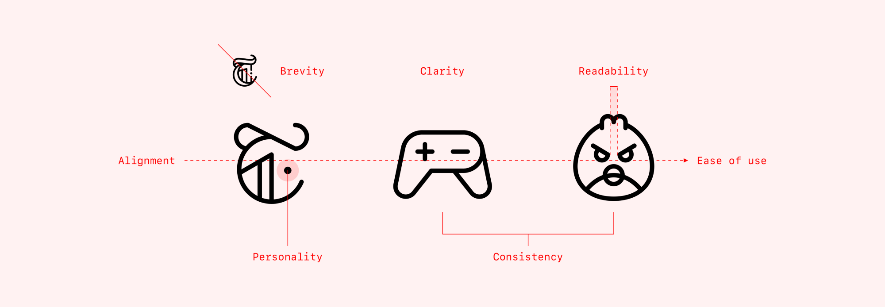

만약 이 글을 읽는 여러분이 iOS나 Android(머터리얼 디자인) 앱을 디자인하고 있다면,
이 아티클이 아주 유용할 것이다.

이 글에서는 UX/UI 디자이너들에게 필요한 iOS와 Android 간 주된 차이점을 다뤄 보고자 한다. 디자이너가 특정 플랫폼의 앱을 다른 플랫폼에 맞게 디자인을 변환할 때 알아야 할 내용을 담고자 했다. 하지만, 이는 어디까지나 가이드일 뿐이며 여기서 언급된 내용 중 일부는 애플이나 구글에서조차도 모순되는 부분이 있음을 기억하자. 이 글은 단지 ‘iOS형 사고’을 ‘Android형 사고'로 바꿔보는 것일 뿐이며, 그 반대로도 마찬가지다. 

다룰 내용은 다음과 같다. 처음부터 쭉 읽거나, 건너뛰거나 각자 원하는 대로 읽도록!

1. 주된 차이점에 대한 개요
2. 내비게이션 측면
3. 선택 제어 장치(컨트롤러) 
4. 타이포그라피 
5. 다른 플랫폼 기준
 

|  Design Element  |  iOS  |  Android  |
| :---- | :----------- | :----- |
|  [Minimum tap target size](https://learnui.design/blog/ios-vs-android-app-ui-design-complete-guide.html?ref=uxdesignweekly#tap-target)  |  44x44 pt  | 48x48 dp ([dp란 무엇일까?](https://learnui.design/blog/ios-vs-android-app-ui-design-complete-guide.html?ref=uxdesignweekly#tap-target)) |

| item2 | item2 description | 100.00 |
{:.mytable}

# 1. iOS vs Android UI 디자인 : 주된 차이점
먼저 iOS에서 Android로, 또는 그 반대로 UX/UI 디자이너가 앱을 변환할 때 고려해야 하는 가장 중요한 차이점들을 살펴보자.

본격적으로 이야기 하기 전에 먼저 기본적이지만 중요한 질문 한 가지에 대답해보자

> Android와 iOS 앱을 다르게 만들어야 할까?

한마디로 말하자면, 아니다.

애플과 구글은 아시다시피 수십억 명의 사용자를 가진 아주 똑똑한 기업이다. 이들도 다른 이들처럼 UX적으로 실수하는 경우가 있지 않을까 싶겠지만, 각 시스템에 맞는 작동 방식에 대해 디자인을 정의할 때 대체로 두 기업은 믿기 어려울만한 큰 실수는 저지르지 않는다. 나는 이 글에서 모든 내용을 iOS와 Android 구분 지어 제시하고는 있지만, 사실 둘 중 어느 것도 틀리지 않다고 말하고 싶다. 여러분이 만든 앱을 사용자가 자신 있게 탐색하고 사용할 수만 있다면, ‘Android에 iOS의 탭이나 모달 뷰를 사용하지 말라’고 그 누구도 말할 수 없다. 

이 글은 ‘iOS/Android에 환경에 맞춰 생각해보자’는 일종의 공부의 개념으로 읽어주면 좋겠다. 하지만, 고유한 시스템 안에서 각 플랫폼에 맞는 앱을 만드는 것이 여러분의 목표라면, 이 글은 아주 유용한 가이드다. 

 그럼 이제 시작해보자.

# 2. iOS vs Android 내비게이션

### 2-1. 화면 상단 내비게이션

왼쪽에서 오른쪽 순서로 이 네비게이션 아이콘들이 의미는 다음과 같다. 피드, 찾기, 스튜디오, 프로필, 그리고 친구 목록. 그래도 VSCO 앱에서의 ‘혼동 비용'은 몇 번의 탭만 거치면 각 아이콘이 무엇을 의미하는지 알아차릴 수 있기 때문에 그나마 낮다.

시간이 흐르면서 반복을 통해 추상적인 것은 익숙해질 수 있다. 이게 [자동차 기호들이 표준화](https://www.iso.org/standard/54513.html)될 수 있었던 이유이다. 요지는 모두에게 공유되는 의미를 구축하는 것이 중요하다. 1984년, 수잔 카레는 애플의 키보드에 있는 ‘기능(Feature)’키의 아이콘을 만드는 임무를 맡았다. 그녀는 북유럽의 관심 장소 표지판에서도 찾아볼 수 있는 이 추상적인 심볼을 만들어냈다.

 

---

 

발행:  2020.03.19 디독 뉴스레터

번역:  노효정

저자 :  [Helena Zhang](https://uxdesign.cc/@minoraxis?source=post_page-----e7187539e4a2----------------------)

원문 링크:  [바로가기](https://uxdesign.cc/7-principles-of-icon-design-e7187539e4a2)
