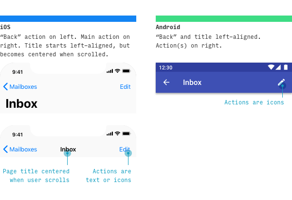

만약 이 글을 읽는 여러분이 iOS나 Android용 앱을 디자인하고 있다면, 이 아티클이 아주 유용할 것이다.

이 글에서는 UX/UI 디자이너들에게 필요한 iOS와 Android 플랫폼 간 나타나는 주된 차이점을 다루고 있다. 디자이너가 특정 플랫폼의 앱을 다른 플랫폼에 맞게 디자인을 변환할 때 알아야 할 내용을 담고자 했다. 하지만, 이는 어디까지나 가이드일 뿐이며 여기서 언급된 내용 중 일부는 애플이나 구글에서조차도 모순되는 부분이 있음을 기억하자. 이 글은 단지 ‘iOS형 사고’을 ‘Android형 사고'로 바꿔보는 것일 뿐이며, 그 반대의 경우도 마찬가지다. 
다룰 내용은 다음과 같다. 처음부터 쭉 읽거나, 건너뛰거나 각자 원하는 대로 읽도록!
 
1. 주된 차이점에 대한 개요
2. 내비게이션 측면
3. 선택 제어 장치(컨트롤러) 
4. 타이포그라피 
5. 다른 플랫폼 기준

# 1. iOS vs Android UI 디자인 : 주된 차이점
먼저, UX/UI 디자이너가 iOS에서 Android로, 또는 그 반대로 앱을 변환할 때 고려해야 하는 가장 중요한 차이점들에 대해서 살펴보자.
 

|  Design Element  |  iOS  |  Android  |
| :---------- | :--------------- | :---------- |
|  Minimum tap target size  |  44x44 pt  |  48x48 dp (dp란 무엇일까?)  |
|  Main app navigation |  하단 탐색(내비게이션)  |  화면 상단 탭  |
|  보조 앱 탐색  |  하단 탐색 메뉴 ‘더보기’ 또는 하단 UI  |  탐색 메뉴 또는 ‘햄버거' 사이드 메뉴  |
|  기본 버튼/액션  |  상단 탐색 메뉴/오른쪽  |  플로팅 액션 버튼  |
|  보조 조치   |  페이지 UI  |  상단 메뉴 탐색/오른쪽  |
|  단일 선택 목록   |  선택된 항목에 체크 표시 목록  |  라디오 버튼 목록  |
|  다중 선택 목록   |  스위치, 또는 선택된 항목에 체크 표시 목록  |  체크박스, 또는 스위치 목록  |
|  제거 동작 진행 여부   |  모달 대화창을 통한 여부 확인  |  임시 화면 알림을 통한 여부 확인  |
{:.mytable}

 
본격적으로 이야기 하기 전에 먼저 기본적이지만 중요한 질문 한 가지에 대답해보자

> Android와 iOS 앱을 다르게 만들어야 할까?

**한마디로 말하자면, 아니다.**

애플과 구글은 아시다시피 수십억 명의 사용자를 가진 아주 똑똑한 기업이다. 이들도 다른 이들처럼 UX적으로 실수하는 경우가 있지 않을까 싶겠지만, 각 시스템에 맞는 작동 방식에 대해 디자인을 정의할 때 대체로 두 기업은 믿기 어려울만한 큰 실수는 저지르지 않는다. 나는 이 글에서 모든 내용을 iOS와 Android 구분 지어 제시하고는 있지만, 사실 둘 중 어느 것도 틀리지 않다고 말하고 싶다. 여러분이 만든 앱을 사용자가 자신 있게 탐색하고 사용할 수만 있다면, ‘Android에 iOS의 탭이나 모달 뷰를 사용하지 말라’고 그 누구도 말할 수 없다. 

이 글은 ‘iOS/Android에 환경에 맞춰 생각해보자’는 일종의 공부의 개념으로 읽어주면 좋겠다. 하지만, 고유한 시스템 안에서 각 플랫폼에 맞는 앱을 만드는 것이 여러분의 목표라면, 이 글은 아주 유용한 가이드다. 

그럼 이제 시작해보자.

# 2. iOS vs Android 내비게이션

### 2-1. 화면 상단 내비게이션

자, 위에서부터 살펴보도록하자. 

각 플랫폼마다 화면 상단에 노출되는 요소에 있어 서로 다른 기준을 가지고 있다. 

먼저 **iOS**에서 상단 왼쪽 액션은 거의 대부분 ‘뒤로 가기'로,  (2단계에서 1단계로 돌아가는) 이전 화면이나 혹은, (인박스에서 메일함으로 이동하는 것과 같은) 상위 화면으로의 순차적인 이동을 의미한다. 간혹 대안으로 전혀 관련 없는 페이지를 연결하는 경우도 있다. 제목은 늘 크게 배치되어 나타나는데, 사용자가 스크롤할 때 헤더 영역과 함께 줄어든다. 상단 오른쪽 액션은 다중 아이콘이나 단일 텍스트로 표시된다. 

**Android**에서 페이지 제목은 왼쪽 정렬로 맞춰 있다. 이때 기본적으로는 제목 바로 왼쪽에 어떤 요소도 있을 필요가 없는데 (a) 만약 해당 페이지가 최상위 페이지이고 앱에 햄버거 버튼이 있는 경우, 제목 바로 왼쪽에 배치하거나 (b) 해당 페이지가 순차적으로 연결되어있는 페이지가 있다면, 선택적으로 ‘뒤로 가기' 버튼을 추가할 수 있다.

리소스 : iOS [내비게이션 바](https://developer.apple.com/design/human-interface-guidelines/ios/bars/navigation-bars/);  머터리얼 디자인 [상단 앱 바](https://material.io/components/app-bars-top/#theming)

 
### 2-2. 주요 기능(목적지) 내비게이션

플랫폼마다 앱의 주요 기능이나 목적지는 각기 다른 방식으로 노출된다. 
**iOS** 앱에서 주요 기능은 하단에 배치되는 탭 형태로 나열되는 것을 볼 수 있다. 
 
1. (대체로) 2~5개의 탭으로 구성되며,
2. 10 정도의 텍스트 사이즈로 표시된다.
3. 이때 텍스트는 주요 화면에 대해 ‘명사형'으로 정리된다. 

실제로 도움이 되는지 알 수 없지만, 인기 있는 다른 iOS 앱에서는 추가로 다음과 같은 가이드를 준수하고 있다.

1. 가령, 사진 앱의 새 사진을 추가하는 것과 같은 앱의 기본 동작 탭은 하단 내비게이션 바의 중앙에 배치한다.
2. 프로필이나 설정과 같은 하단 탭은 바의 제일 마지막 위치에 배치한다.
3. 검색은 내비게이션 바에서 두 번째 위치에 배치한다.   

반면, iOS의 디폴트(기본) 앱은 (1) 하단 탭 바 활용이 적고 (2) 프로필 또는 설정 관련 탭이 없으며 (3) (스크롤을 통해) 검색은 마지막 순서로 나타난다. 

**Android** 앱에서 가장 큰 차이점은 동일한 주요 기능이 인터페이스 전체적으로 더 많이 노출되어 있다는 것이다. (a) 햄버거 버튼, (b) 검색 바, (c) 탭 또는 (d) 플로팅 액션 버튼을 들 수 있는데, 이 4개 항목에 대해서는 나중에 추가로 더 이야기하도록 하자. 참고로 Android는 iOS와 비슷하게 하단 내비게이션 바를 사용하기 때문에 여러분이 느끼는 차이가 작을 수 있다.  

리소스 : iOS [탭 바](https://developer.apple.com/design/human-interface-guidelines/ios/bars/tab-bars/);  머터리얼 디자인 [이해 탐색 (내비게이션)](https://material.io/design/navigation/understanding-navigation.html) (이는 좀 더 이론적인 글이다)

### 2-3. 부가 기능(목적지) 내비게이션

**iOS**에서 하단 탭 바에 배치할 수 없는 기능은 (a) ‘더보기' 탭으로 분리되거나 (b) 다른 화면에서 왼쪽이나 오른쪽 상단의 액션으로 노출될 수 있다.

**Android**에서는 부가적인 화면은 햄버거 버튼을 누르면 나타나는 측면 메뉴에 나열된다.

참고로 애플은 햄버거 버튼을 권장하고 있진 않지만, 이미 많은 타사의 iOS 앱에서 활용하고 있다. 햄버거 버튼을 사용하든 사용하지 않든 간에 [가장 좋은 방법은 중요한 것은 어떤 상황에서도 숨기지 않는 것이다.](https://www.lukew.com/ff/entry.asp?1945)

리소스 : 머터리얼 디자인 [드로어 내비게이션](https://material.io/components/navigation-drawer/)

### 2-4. 뒤로 가기

**iOS**에서는 상황에 따라 4가지 방법으로 이전 페이지를 탐색할 수 있다. 

|  다시 탐색하는 방법(iOS)  |  작동 상황  |
| :--------------- | :--------------- |
| 화면 왼쪽 상단에서 ‘뒤로 가기' 액션 누르기 | ‘뒤로 가기' 동작이 나타나는 모든 화면 |
| 화면 왼쪽 가장자리에서 오른쪽으로 스와이프 | 왼쪽 상단 ‘뒤로 가기' 동작이 나타나는 화면 |
| 화면 왼쪽 상단에서 ‘뒤로 가기' 액션 누르기 | 더 이상 편집할 필요 없는 모달 뷰 |
| 화면 내용을 아래로 스와이프 | 모달 또는 전체 화면 보기 |
{:.mytable}

> 모달 및 전체 화면 보기가 도대체 무슨 말이야?

**여러분이 그럴 줄 알고 준비했다.**

모달 뷰는 전체 화면 위로 미끄러지듯 나타나는 하나의 작업 화면을 말한다. (앞서 탐색하던) 이전 화면은 모달 뷰의 백그라운드로 배치되는데 이때 ‘아래로 스와이프’하거나 ‘뒤로 가기'를 누르면 모달 뷰를 제거할 수 있다.  

전체 화면을 차지하는 사진이나 비디오 같은 미디어가 대체로 풀스크린 보기 방식을 취하는데,  iOS와 마찬가지로 Android 또한 아래로 스와이프하는 동작을 통해 제거할 수 있다. 

**Android**에서 ‘뒤로 가기'는 훨씬 더 간단하다. Android 10 이상부터 화면 양쪽을 가볍게 스치면 뒤로 넘어간다. Android 9의 경우에는 화면 왼쪽 하단에 있는 ‘뒤로 가기' 버튼을 눌러야 한다. 

# 3. iOS vs Android 제어 장치(컨트롤) 디자인

### 3-1. 중요한 콜 투 액션(Call-to-action) 버튼

**iOS**에서 페이지의 주요 버튼은 대게 오른쪽 상단에 위치한다. 

반면, **Android**에 페이지의 주요 버튼은 오른쪽 하단에 플로팅 액션 버튼-짧게는 FAB라고 부르는-으로 나타난다. 

간혹 **iOS**에서 중요한 페이지 액션이 하단 도구 모음에 나타나는 경우가 있다. 애플에서는 이를 탭 바와 차별화된다는 점을 특히 강조한다. 

이와 마찬가지로 **Android**에서는 간혹 중요한 페이지 액션 버튼이 화면 상단에 나타난다.

리소스 : iOS [버튼](https://developer.apple.com/design/human-interface-guidelines/ios/controls/buttons/);  머터리얼 디자인 [플로팅 액션 버튼](https://material.io/components/buttons-floating-action-button/)

### 3-2. 검색

**iOS**와 **Android** 둘 다 공통적으로 검색은 매우 유연한 제어 요소이다.

때론 앱의 주요 포인트이기도 하고, 다른 때에는 기본적인 가장자리 사용 사례가 되는데, 대부분의 경우 이 두 가지 경우 사이에 존재한다. 예상하겠지만, 각 플랫폼들은 이 부분에 있어서 융통성 있게 대응한다. 

iOS와 Android 검색 스타일의 한 가지 차이점은 
- iOS에서는 검색을 취소하기 위해서는 ‘취소’ 버튼을 눌러야 하지만, Android에서는 ‘←‘를 눌러야 한다. 
- 현재 입력한 값은 지우되 검색 화면을 유지하고자 한다면, iOS와 Android 모두 ‘X’를 눌러야 한다. 

특히 검색이 매우 중요한 기능일 경우에는 iOS와 Android 모두 검색 바를 바로 직접적으로 표시한다. 이런 경우 늘 그렇듯이 검색 바를 누르면 완전히 다른 화면으로 전환되는 특징을 갖고 있다. 

반대로 검색이 중요하거나 일반적이지 않을 경우, 다른 위치를 통해 검색에 접근할 수 있다.

<

**iOS**에서는 검색을 기본 탭 중 하나 또는 상단에 내비게이션의 액션으로 배치되는 것이 일반적이다.

한편, **Android**에서는 상단 바의 상황별 액션을 통해 검색할 수 있다.  

리소스 : iOS [검색 바](https://developer.apple.com/design/human-interface-guidelines/ios/bars/search-bars/);  머터리얼 디자인 [검색 패턴](https://material.io/archive/guidelines/patterns/search.html)

### 3-3. 액션 메뉴

**iOS**에서 액션 메뉴는 특정 버튼이나 행동을 통해 나타나며, 엄지손가락으로 쉽게 닿는 하단에서부터 미끄러지듯 올라오는 것이 특징이다. 

하지만, **Android**는 3개의 점, 일명 케밥 메뉴 아이콘(더 많은 옵션을 나타내는 Android 아이콘)을 눌렀을 때 하단에서 나타난다. 특히 맨 아래에서 해당 메뉴가 나타나는 경우는, 대게 취할 수 있는 액션이 많을 때 일어난다. 
두 플랫폼 모두 액션 메뉴에 대한 표준 가이드가 있다. 

‘컨텍스트 메뉴’라고 불리는 **iOS 13**에서의 새로운 기능은 요소를 누르고 있을 때 관련된 액션 가능한 메뉴들을 보여준다. 컨텍스트 메뉴가 표시되면 이때 백그라운드는 흐려진다. 
 
반면 **Android**에서는 많은 메뉴가 요소 위에 직접 배치되는데, 새로운 버전의 Android에서는 메뉴가 케밥 아이콘 자체를 덮으며 나타난다.

리소스 : iOS [액션 시트](https://developer.apple.com/design/human-interface-guidelines/ios/views/action-sheets/), [컨텍스트 메뉴](https://developer.apple.com/design/human-interface-guidelines/ios/controls/context-menus/);  머터리얼 디자인 [메뉴](https://material.io/components/menus/), [하단 시트](https://material.io/components/sheets-bottom/#)

### 3-4. 선택 제어 장치

 

---

 

발행:  2020.03.19 디독 뉴스레터

번역:  노효정

저자 :  [Helena Zhang](https://uxdesign.cc/@minoraxis?source=post_page-----e7187539e4a2----------------------)

원문 링크:  [바로가기](https://uxdesign.cc/7-principles-of-icon-design-e7187539e4a2)
