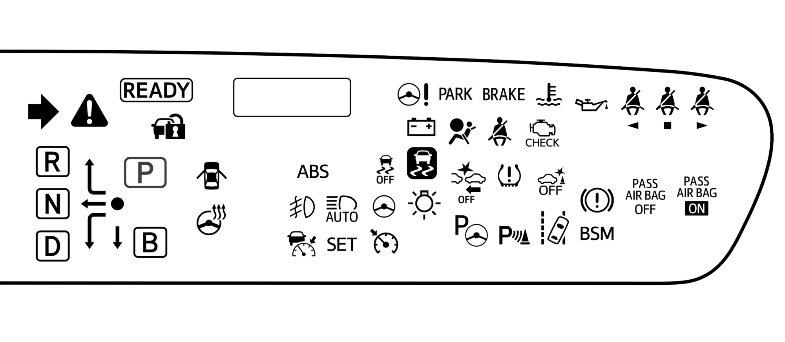
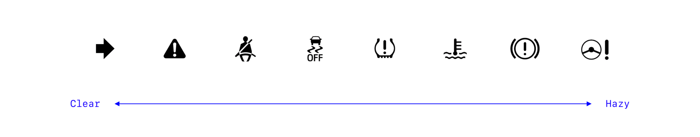
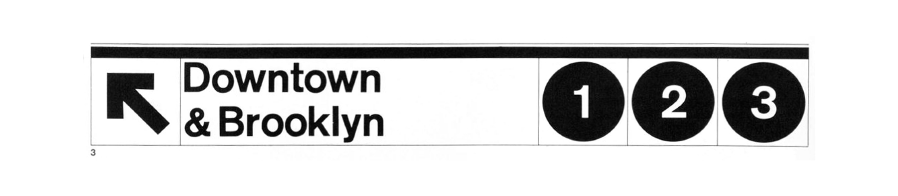
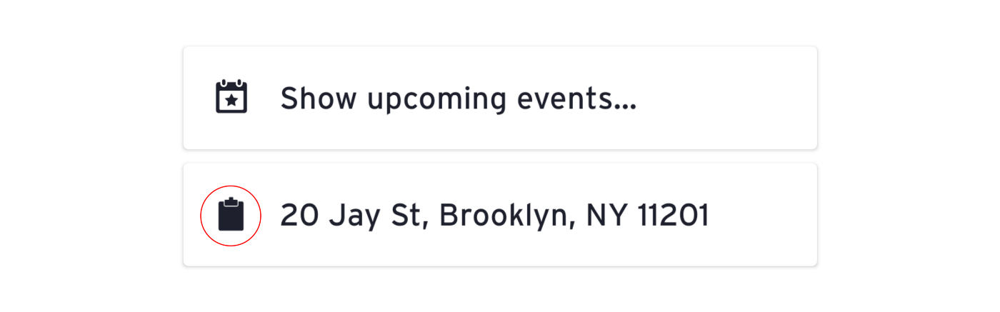
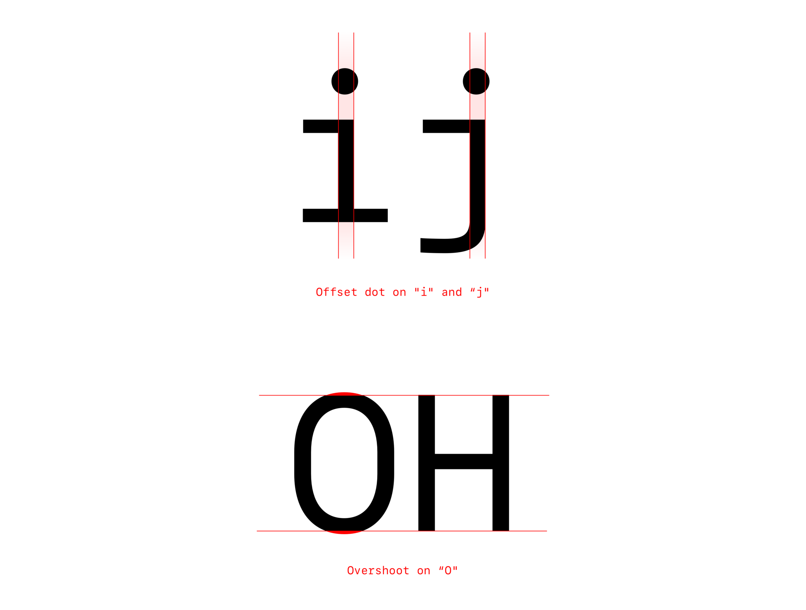
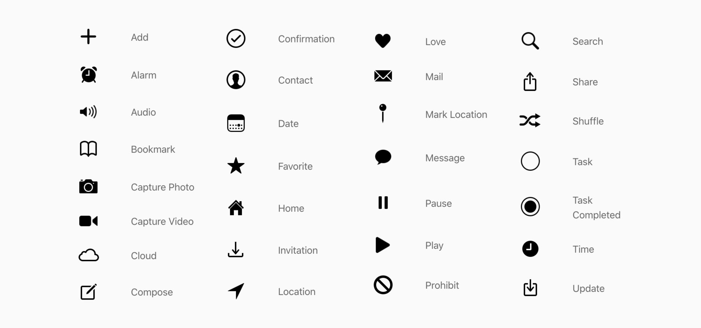
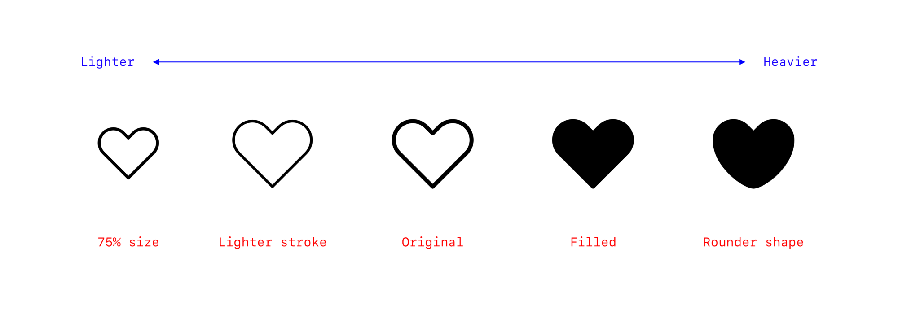
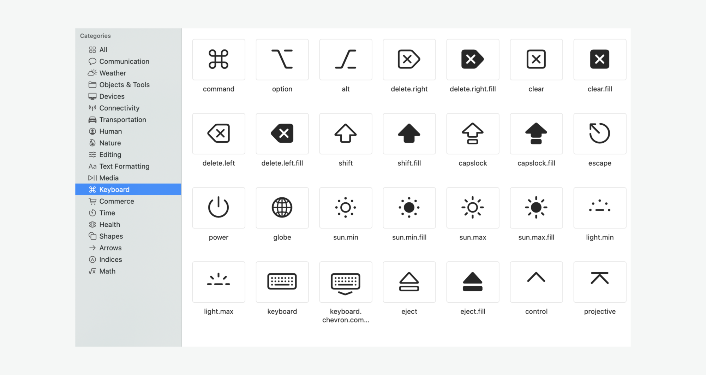
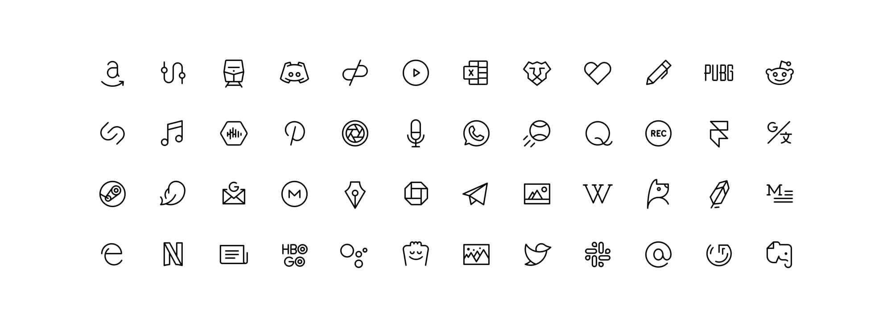

높은 퀄리티의 아이콘 세트를 만들기 위해서는 신중한 접근, 숙련된 안목, 약간의 반복 그리고 많은 연습이 필요하다. 앞으로 이어질 내용에서는 7가지 아이콘 디자인 원칙과 함께 다양한 실제 사례를 가지고 퀄리티의 특징들에 대해 설명하고 있다. ‘좋은’ 아이콘 디자인에서 나타나는 중요한 특징들에 여러분의 기준을 맞추는 게 이 글의 목표이다.

# 명료성
어떠한 개념을 빠르게 전달하는 것이 아이콘의 주된 역할이라 할 수 있다

<figcaption> Icons on a Prius Prime instrument cluster (Source: <a href="https://www.toyota.com/t3Portal/document/om-s/OM47C77U/pdf/OM47C77U.pdf" target="_blank">2020 Manual</a>)</figcaption>

이 많은 기호들 속, 의미가 명확하게 전달되고 있는 것은 무엇인가? 경험에 의해 운전자들이 의미를 학습할 수 있겠지만, 기호들 중 일부는 직관적이지 않아 보인다. 여러분이 그 의미를 설명해주는 매뉴얼을 확인했을 때 비로소 그 의미를 알아차릴 수 있다.

나의 기준으로 이 기호들을 나열했을 때 대략 다음과 같다.

낯선 은유로 표현된 아이콘은 이해하기가 어렵다. 안전벨트 ‘기억등’(왼쪽에서 3번째)의 경우, 문자 그대로 표현되어 있기 때문에 빠르게 파악할 수 있다. 반면 "전기 파워 스티어링 시스템 경고등"(맨 오른쪽)은 너무 모호하게 전달된다.

내가 접한 가장 불분명하다고 느꼈던 아이콘 중 일부는 VSCO라는 사진 앱에서 찾아볼 수 있다. 이 아이콘들이 무엇을 의미히는지 짐작되는가?
 

<figcaption>icon in the VSCO app</figcaption>

왼쪽에서 오른쪽 순서로 이 네비게이션 아이콘들이 의미는 다음과 같다. 피드, 찾기, 스튜디오, 프로필, 그리고 친구 목록. 그래도 VSCO 앱에서의 ‘혼동 비용'은 몇 번의 탭만 거치면 각 아이콘이 무엇을 의미하는지 알아차릴 수 있기 때문에 그나마 낮다.

시간이 흐르면서 반복을 통해 추상적인 것은 익숙해질 수 있다. 이게 [자동차 기호들이 표준화,](https://www.iso.org/standard/54513.html)될 수 있었던 이유이다. 요지는 모두에게 공유되는 의미를 구축하는 것이 중요하다. 1984년, 수잔 카레는 애플의 키보드에 있는 ‘기능(Feature)’키의 아이콘을 만드는 임무를 맡았다. 그녀는 북유럽의 관심 장소 표지판에서도 찾아볼 수 있는 이 추상적인 심볼을 만들어냈다.

<figcaption>Command icon in SF Pro</figcaption>

이제 이 커맨드(Command) 아이콘을 애플 키보드의 커맨드 키라고 칭하는 것은 당연하다. [여기서 수잔 카레가 자신의 놀라운 일에 대해 이야기하는 것을 볼 수 있다.](https://vimeo.com/97583369) 

수잔 카레가 커맨드 키를 창조할 수 있었던 건 기존에 어떤 기준이 마련되어 있지 않았기 때문이다. 아이콘을 만들 때 설정을 표현하는 톱니바퀴처럼 기존에 통용되고 있는 은유가 있는지, 또는 바퀴(어떤 은유적 형태)를 발명하는 것이 적절한지에 대해 고민해보아야 한다.

여기 우리가 좀 더 친숙하게 느끼는 사랑, 경고, 음악, 그리고 위/앞 화살표 아이콘이 있다.

<figcaption> Familiar metaphors from <a href="https://play.google.com/store/apps/details?id=com.tobiasfried.phosphor" target="_blank">Phosphor Carbon</a>icon family</figcaption>

 
화살표는 길 찾기에 사용되는, 간단하지만 강력한 기호라 할 수 있다.

<figcaption> NYC subway sign (Source: <a href="https://standardsmanual.com/pages/original-nycta" target="_blank">Standards Manual</a>)</figcaption>

아이콘의 가장 성공적인 경우는, 한쪽의 사람들만이 이해하기 쉬운 경우가 아니라 문화, 나이, 배경 전반에 걸쳐 보편적일 때를 말한다. 항상 사람을 중심으로 그들에게 반향을 불러일으킬 은유와 색을 사용하라.

# 가독성

일단 이해할 수 있도록 기호를 만들었다면 그 의미를 명확히 읽을 수 있는지 확인하라.

<figcaption> Icons in the Amtrak mobile app </figcaption>

위의 Amtrak 앱에서 첫 번째 아이콘인 정거장(Station)의 경우, 지나치게 디테일해서 알아보기 어렵다.

Transit 앱도 비슷한 이슈를 가지고 있다. 클립 보드 아이콘은 보드와 클립 형태 사이의 공간이 너무 작아 때문에, 그냥 어떤 작은 형체 정도로 읽힌다.

<figcaption> Icons in the Transit mobile app </figcaption>

약간만 조정하면 크게 달라지는데

<figcaption> Adjusted clipboard icon </figcaption>

여러 형태의 결합으로 아이콘을 작업할 때는 그 사이에 충분한 공간을 두도록 하자. 얇은 테두리와 수많은 획은 아이콘을 더 복잡하고 읽기 어렵게 만든다.

이 부분에서 Google Maps은 아주 멋지게 일을 처리했다. Google Maps의 교통 아이콘들은 아주 작은 크기지만 훌륭한 가독성을 지니고 있다.

<figcaption> Google Map icons </figcaption>

# 정렬성

각 아이콘이 균형을 이루도록 하기 위해서는 해당 요소들의 시각적 정렬이 필요하다.

<figcaption> Unbalanced play icon </figcaption>

사실 이 재생 아이콘의 삼각형은 수치적으로 원의 중심에 배치되어 있지만, 우리의 눈은 이를 어긋나 있다고 느낀다. 삼각형 형태의 넓은 부분이 뾰족한 부분보다 ‘무겁게' 느껴져서 왼쪽으로 기울어져 보이는 것이다.

타이포그래퍼가 착시현상을 고려해 서체의 균형을 맞추고자 미세하게 조정하듯, 다음 그림의 ‘i’와 ‘j’ 서체에서 중심을 벗어난 점과 평행선을 벗어난 ‘O’에 주목해보자.

아이콘도 균형을 맞추기 위해서는 이와 비슷하게 조정이 필요하다. 위의 예(재생 아이콘)를 수정하려면 삼각형 요소를 좀 더 오른쪽으로 이동시켜야 한다.

<figcaption> Balanced play icon </figcaption>

훨씬 나아보지 않는가.

여기서 기억해야 할 점은, 단순하게 숫자를 믿지 말고 여러분의 눈으로 살피며 작업해야 한다는 점이다.

# 간결성

단 몇 마디만으로 잘 표현된 아이디어는 유능하고 우아하게 느껴진다. 예를 들어:

> 여러분이 알고 있는 것을 가르쳤을 때 그 주제에 대하여 
본인 스스로의 이해도도 강화된다.

(로버트 하인레인으로부터) 이를 더 간결하게 말하자면,

>한 사람을 가르칠 때 두 사람이 배운다.

정말 멋지지 않은가
머터리얼은 이와 같은 표현 대신, 시스템 아이콘 가이드를 통해 간결성을 잘 보여주고 있다.

<figcaption> Overly complex boat icon (Source: <a href="https://material.io/design/iconography/system-icons.html" target="_blank">Material</a>)</figcaption>

간단하게 말하면 다음과 같다.

<figcaption> Succinct boat icon (Source: <a href="https://material.io/design/iconography/system-icons.html" target="_blank">Material</a>)</figcaption>

우리는 자주 작은 캔버스 위에 작업을 진행하기 때문에 아이콘 디자인 시 간결하게 함축하는 것이 필요하다. 아이콘에 맞는 디테일을 살리되 여러분이 필요하다고 생각하는 만큼 표현하지 않으면 된다.

유저 인터페이스에서 간결하게 정돈한 스타일은 요지를 손쉽게 이해시킨다. 여기엔 텔레그램의 아이콘이 좋은 예가 될 것이다 :

<figcaption> Telegram icons </figcaption>

간혹 UI 아이콘은 보다 설명적인 스타일로 표현되는 경우도 있다. 이 다중톤의 Yelp 아이콘들은 인기 있는 음식 검색을 시각화한 흥미로운 방식이다. 특히 태국 음식 아이콘의 새우는 정교하게 표현되어 있다.

<figcaption> Yelp icons by <a href="https://www.instagram.com/scottt0023/" target="_blank">Scott Tusk</a></figcaption>

모바일, 태블릿 및 데스크탑 애플리케이션을 나타내는 앱 아이콘은 적절한 수준의 디테일을 통해 입체감과 색상을 표현할 수 있다. 이는 시청자들이 모바일 홈 스크린, 독스, 앱 스토어에서 브랜드의 맥락을 이해하기 때문에, 앱 아이콘에서도 보다 더 브랜드와 제품에 대해 표현할 수 있는 것이다.

<figcaption> Apple <a href="https://developer.apple.com/design/human-interface-guidelines/ios/icons-and-images/app-icon/" target="_blank">app icons</a>for Procreate, Firefox, and Netflix</figcaption>

# 일관성

아이콘 세트가 조화를 이루기 위해서는 같은 스타일 규칙을 계속 유지해야 한다.
iOS 13 이전에 애플의 아이콘은 다양한 종류의 테두리와 필 처리 및 크기를 보여왔다.

<figcaption> Icons from Apple’s  <a href="https://developer.apple.com/design/human-interface-guidelines/ios/icons-and-images/system-icons/" target="_blank">Home Screen Quick Actions</a> pre-iOS 13.</figcaption>

이 아이콘 세트를 유심히 살펴보자. 이 중 다른 아이콘들보다 더 무겁게 느껴지는 아이콘들이 있는가?

어떤 아이콘이든 필 처리, 테두리 두께와 크기 및 모양과 같은 변수들에 의해 결정된 시각적 무게를 가지고 있다. 이러한 변수들을 전체적으로 동일한 수준으로 맞췄을 때 비로소 일관성이 구축되는 것이다.

최근 애플은 [San Francisco,](https://developer.apple.com/fonts/)의 연장선으로 [SF 기호를 도입,](https://developer.apple.com/videos/play/wwdc2019/206)하면서 코스를 수정했다. SF 기호는 보다 발전된 그래픽 아이콘 스타일로, 9가지의 무게감과 3가지 크기를 가지고 있다. (이는 약간 복잡하지만, 신중했던 것이 분명하다.) 아이콘과 아이콘 간, 필 처리와 아웃라인 변형 사이에서, 이것들이 보다 더 조화로워 졌음을 알 수 있다.

<figcaption> Icons from Apple’s<a href="https://developer.apple.com/design/human-interface-guidelines/sf-symbols/overview/" target="_blank">SF Symbols</a></figcaption>

특히, 여러 명의 디자이너가 함께 제작하고 있는 상황에서, 규모가 큰 아이콘 세트에 일관성을 유지하는 것은 쉬운 일이 아니다. 따라서 전체를 아우르는 명확한 원칙과 규칙을 정립하는 것이 중요하다.

심혈을 기울여 여러 명이 함께 디자인하고 만든 Phosphor Carbon 아이콘 세트의 경우, 동일한 가이드라인을 준수하며 각 아이콘마다 엄격한 테스트를 거쳐, 700개 이상의 아이콘의 일관성을 유지하고 있다. 각각 모양은 다르지만 같은 무게감을 지니고 있으며 모두가 잘 어울린다.

<figcaption> Subset of the<a href="https://play.google.com/store/apps/details?id=com.tobiasfried.phosphor" target="_blank">Phosphor Carbon </a>icon family</figcaption>

# 특성

모든 아이콘 세트에는 특징이 존재한다. 그것들을 독특하게 만드는 것이 무엇일까? 브랜드가 어떻게 전달되고 있는지? 어떤 분위기를 만들어내고 있는지 생각해볼 필요가 있다.